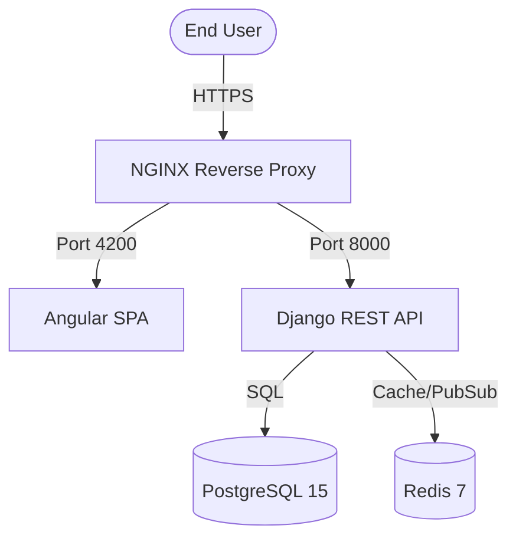

# Exam Platform V2 - Advanced Assessment System

An enterprise-ready, containerized Online Exam Platform specializing in secure delivery, automated evaluation, and detailed audit logging.

---

## 🏗️ Architecture & Infrastructure

The platform follows a modern, microservices-oriented architecture using **Docker Compose** for local and production deployment.



### Technology Stack
- **Frontend**: Angular 18 LTS, TypeScript, RXJS.
- **Backend**: Django 4.2 LTS (REST Framework), JWT Authentication.
- **Persistence**: PostgreSQL 15 (Relational Data).
- **Caching/State**: Redis 7 (Token Blacklisting & Session State).
- **Environment**: Containerized with Docker & Docker Compose.

---

## 📂 Project Structure

```text
Exam_Platform/
├── backend/                # Django REST API (Core Logic)
│   ├── apps/               # Business Applications
│   │   ├── users/          # Auth, RBAC, Auditing
│   │   ├── question_bank/  # Topic-wise Question Management
│   │   └── assessments/    # Exam Engines & Logic
│   └── config/             # System Settings
├── frontend/               # Angular 18 Application
│   └── src/app/            # Modular Component Architecture
├── docker-compose.yml      # Infrastructure Definition
├── restart_app.sh          # Intelligent Service Manager
├── backup_db.sh            # One-click Safety Snapshots
├── reset_db.sh             # Factory Reset Script (DANGER)
└── export_data_to_csv.py   # Data Analytics & Export Tool
```

---

## 🚀 Bringup & Deployment

### 1. Initial Setup
```bash
git clone git@github.com:Lee020/Exam_Platform.git
cd Exam_Platform
cp .env.example .env
```

### 2. Standard Launch
```bash
./restart_app.sh
```
*This script ensures Postgres and Redis are healthy before launching the API and Frontend.*

- **Access Console**: http://localhost:4200
- **Default Credentials**: `admin` / `admin123`

---

## 🛠️ Integrated Tooling

| Tool | Usage | Effect |
| :--- | :--- | :--- |
| **`./restart_app.sh`** | `sudo ./restart_app.sh` | Restarts all containers safely. **Persistence is maintained.** |
| **`./backup_db.sh`** | `./backup_db.sh` | Creates a timestamped `.sql` file in `/backups`. |
| **`./reset_db.sh`** | `sudo ./reset_db.sh` | **DANGER**: Wipes all data. Returns system to factory defaults. |
| **`export_data_to_csv.py`** | `python3 export_data_to_csv.py` | Generates Excel-ready reports in `/exports`. |

---

## 📦 Packing & Migration (V2)

### Moving to a New Server
1. **Pack the Image**:
   ```bash
   sudo docker build -t exam-platform-v2 -f Dockerfile.unified .
   ```
2. **Move Key Files**:
   Ensure you have the latest `.sql` backup from `/backups`, the `.env` file, and `docker-compose.yml`.
3. **Bringup on New Hardware**:
   ```bash
   sudo docker-compose up -d
   cat your_backup.sql | sudo docker exec -i exam_postgres psql -U exam_user -d exam_db
   ```

---

## 🛡️ Resilience & Crash Handling

- **Auto-Restart**: All services are configured with `restart: unless-stopped`.
- **Database Health**: The system uses Docker health checks to prevent the Backend from starting before the Database is ready for queries.
- **Crash Recovery**: If the system hangs, run `./restart_app.sh`. This clears the container cache while preserving the `postgres_data` volume.

---

## 📄 Release Information (V2)
- **Tag**: `v2.0`
- **Branch**: `v2` (Maintained for security patches)
- **Status**: Production Ready ✅
